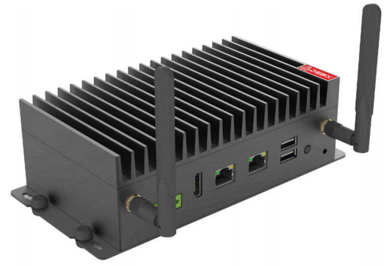
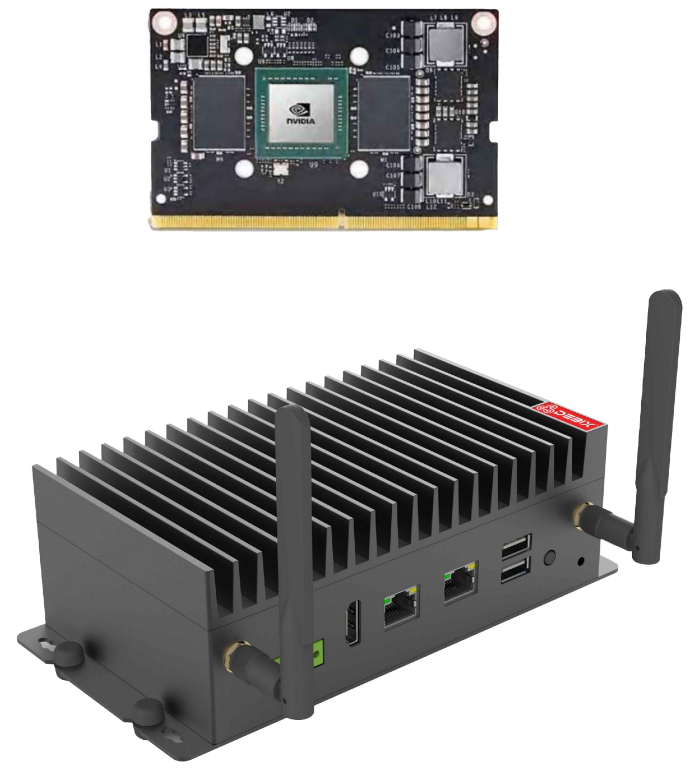

# BPC-EA-200 NVIDIA Jetson Series Edge AI Computing
 

## Overview
The BPC-EA-200, powered by NVIDIA Jetson Series, is an industrial-grade ultra-compact embedded system engineered for edge AI deployments. It is equipped with NVIDIA Jetson TX2 NX core module. NVIDIA Jetson™ TX2 NX provides a new generation of embedded edge computing products for entry-level AI performance. It delivers efficient AI processing for security surweillance systems, smart retail and industrial automation platforms.

## Specification
| System          |                 |
|-----------------|-----------------|
| CPU             | NVIDIA Jetson TX2 NX Module, 2 x Denver2 Core and 4 x ARM Cortex-A57 MPCore processor. The PWR consumption is 7.5W/15W. |
| Memory          | Onboard 4GB LPDDR4 |
| Storage         | Onboard 16GB eMMC  |
| OS              | Linux OS |
|**Communication**|               
| Gigabit Ethernet | 2 x Gigabit Ethernet ports |
|**Display**|
| Display | 1 x HDMI output |
| MIPI CSI | 2 x MIPI CSI |
|**I/O**|  
|  | 2 x USB3.0 1 x Type-C 1 x RS485/RS422/RS232 4 x GPIO 1 x CAN |
|**Expansion**|
|  | 1 x MiniPCIe/1 x M.2 E-Key 2230 for WiFi 1 x M.2 M-Key 2280 NVME (PCIe) 1 x M.2 B-Key for LTE/5G 1 x Nano SIM slot 1 x TF slot |
|**Power Supply**|
| Power Input | DC 12~24V |
|**Mechanical & Environmental**|
| Enclosure Material | Steel and aluminum alloy |
| Dimension   | 189mm(W) x 96.7mm(H) x 57.5mm(D) (±0.5mm) |
| Operating Temp. | -20℃~+60℃ CPU/GPU Full Loaded Operation; -20℃~+75℃ Frequency Reduction Operation  |
| Storage Temp. | -40℃ to +75℃ |

## Safety Instructions:
***To aviod malfunction or damage to this product please observe the following:*** 
- Disconnect the device from the DC power supply before cleaning. Use a rag. Do not use liquid 
detergents or spray-on detergents.
- Keep the device away from moisture.
- During installation, put the device on a reliable table. It will be damaged if you drop it.
- Before connecting the power supply, ensure that the voltage is in the required range.
- Put the power cable in place to avoid stepping on it
- If the device is not used for a long time, power it off to avoid damage caused by sudden overvoltage.
- Do not pour liquid into the hold of the enclosure, as this could cause fire or electrocution.
- For safety reasons, the device can only be disassembled by professional personnel.
- Do not place the device outside the specified ambient temperature range. This will damage the machine. It needs to be kept in an environment at controlled temperature.

## Contact Us
- **Headquarters**: DEBIX Technology Inc., 8345 Gold River Ct., Las Vegas, NV 89113, USA  
- **Factory**: 5-6/F., East Zone, Shunheda A2 Building, Liqxiandong Industrial Park, XiLi, Nanshan Dist., Shenzhen, China 
- **Email**: info@debix.io  
- **Website**: [www.debix.io](https://www.debix.io)  
- **Community**: [Discord](https://discord.com/invite/adaHHaDkH2)

